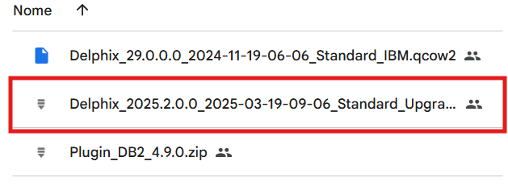
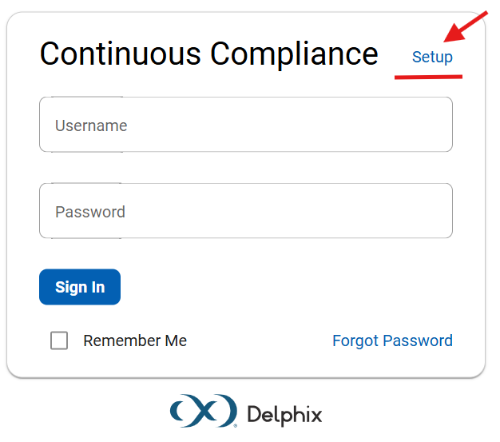
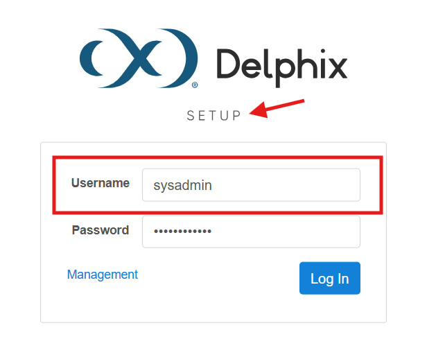
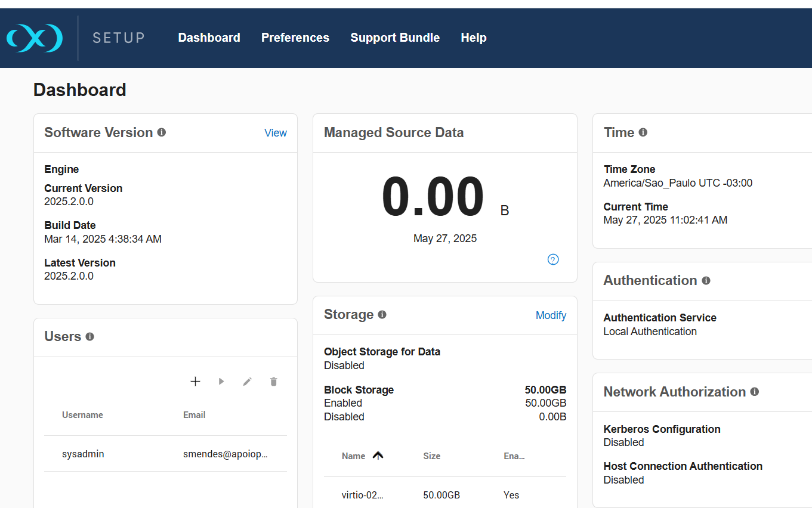
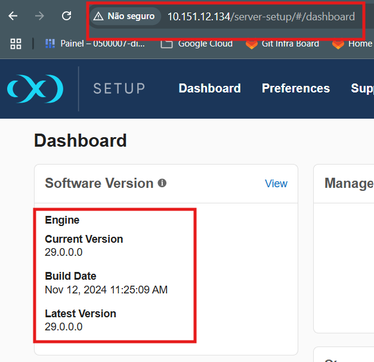
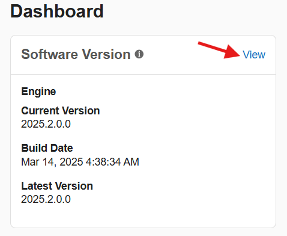
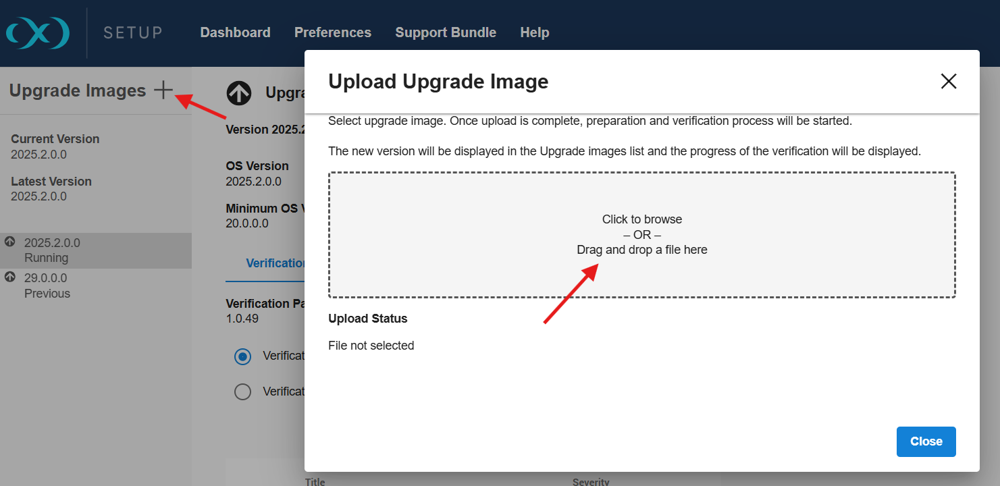
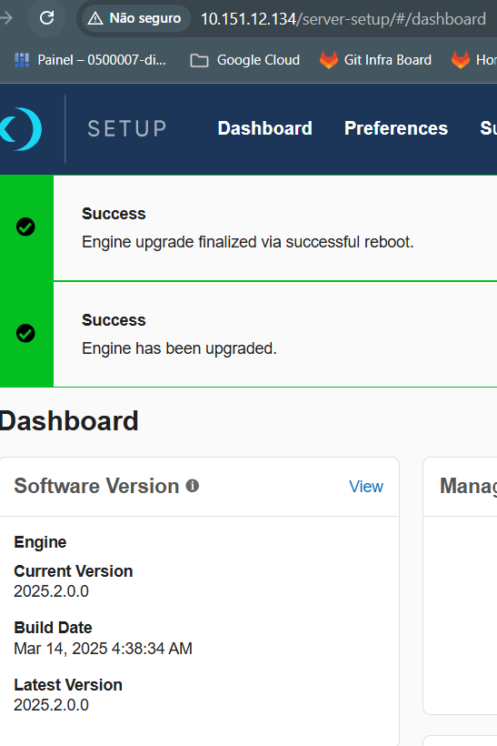

## Aplicação de Update Security junto ao Delphix

## Binários - Delphix \ Security Patche

Link para download: https://drive.google.com/drive/folders/1x9djUH_7koiCMBThgorR5ovvgGrZpPmY?usp=sharing

Nome: Delphix_2025.2.0.0_2025-03-19-09-06_Standard_Upgrade

### Login - Sysadmin

url: http://x.x.x.x/login/index.html#serverSetup (Inserir o IP do Host do Delphix))

Alterar a tela inicial para Setup aonde é possível se aplicar patches de segurança. 

Após entrar no link Setup a tela de logon será alterada.

### Tela Inicial como Sysadmin

### Status Original - Masking

Através do widget é possível notar que não existe patche aplicado.

## Para carregar a imagem

Entrar no widget do versionamento - opção VIEW

Depois subir a imagem

Após validar que a imagem subiu corretamente deve-se mandar "aplicar" o mesmo, o processo pode demorar, ao final verificar o status.

# Obs. É recomendado o reboot do host via GUI.