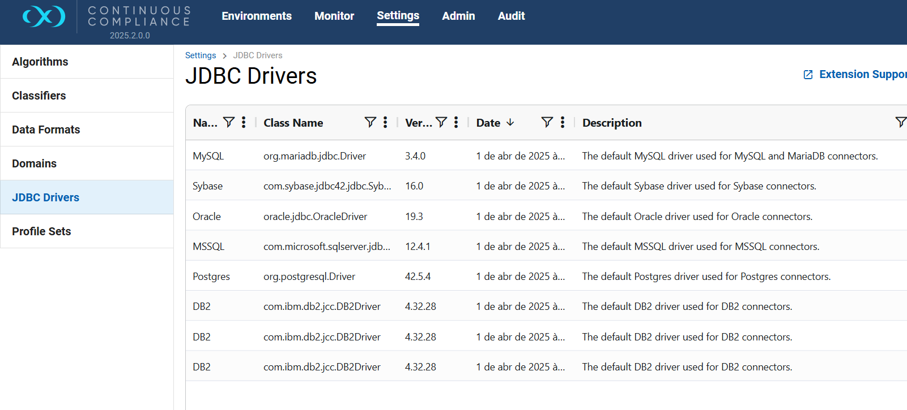
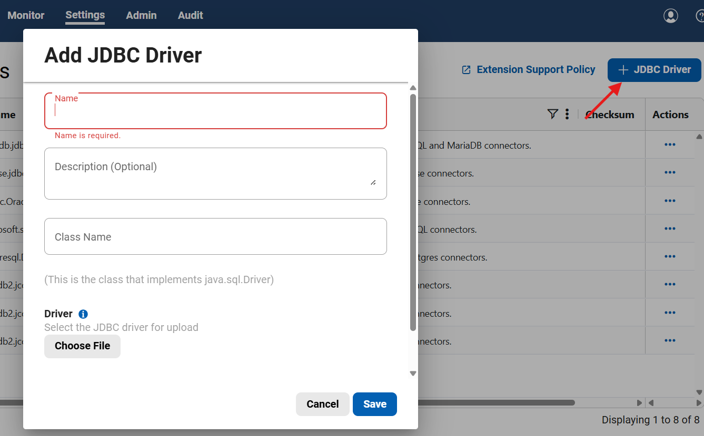

### Drivers JDBC Delphix - Mascaramento

## Info - Drivers

Como recomendação deve ser verificado a versão do driver jdbc atual disponibilizada no Delphix, nos testes realizados em DEV a versão utilizada foi da ferramenta.

Caso não exista o driver correto, ou seja necessário se utilizar outro, o mesmo pode ser incluido manualmente.

