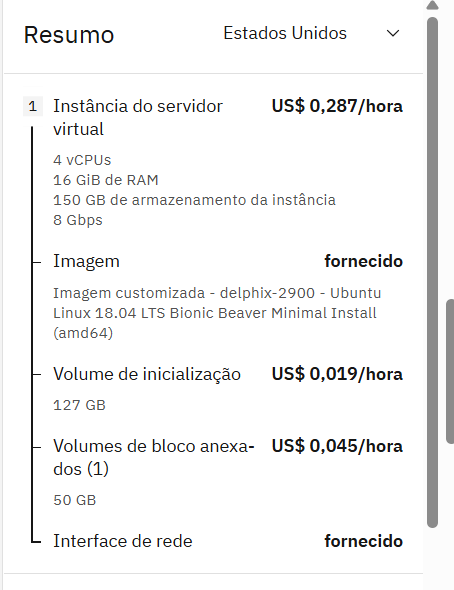
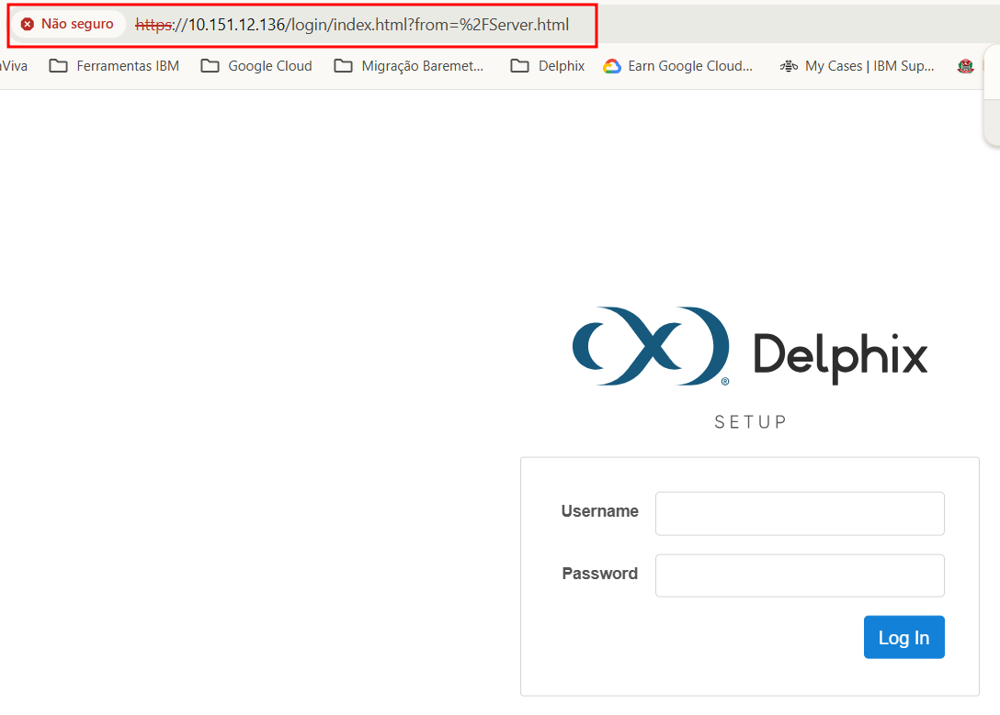

## Sobre

Perforce Delphix é uma plataforma de dados DevOps que ajuda as empresas a acelerar a velocidade de desenvolvimento, entregar qualidade de software e garantir a conformidade e a segurança dos dados.

## Documentação Oficial Delphix

Na documentação oficial do produto existe o detalhamento de como subir a imagem do Delphix, e atrelar a um host para seu provimento.

https://cd.delphix.com/docs/latest/procedure-for-deploying-in-the-ibm-cloud

## Instâncias

Abaixo é informada as **instâncias dos ambientes** de **DESENVOLVIMENTO e PRODUÇÃO**.

| Name                    | Type           | Environment     | Region             | Version    |
| ------------------------- | ---------------- | ----------------- | -------------------- | ------------ |
| DELPHIX VIRTUALIZAÇÃO | Type Instances | Desenvolvimento | southamerica-east1 | V 29.0.0.0 |
| DELPHIX MASCARAMENTO    | Type Instances | Desenvolvimento | southamerica-east1 | V 29.0.0.0 |

| Name                    | Type           | Environment | Region             | Version    |
| ------------------------- | ---------------- | ------------- | -------------------- | ------------ |
| DELPHIX VIRTUALIZAÇÃO | Type Instances | Produção  | southamerica-east1 | V 29.0.0.0 |
| DELPHIX MASCARAMENTO    | Type Instances | Produção  | southamerica-east1 | V 29.0.0.0 |

## Info do Produto

O Serviço será utilizado como duplicação de databases e mascaramento de dados.

## Binários

Link para download: https://drive.google.com/drive/folders/1x9djUH_7koiCMBThgorR5ovvgGrZpPmY?usp=sharing

| Binário                                             | Tipo                      |
| ------------------------------------------------------ | --------------------------- |
| Delphix_29.0.0.0_2024-11-19-06-06_Standard_IBM       | Produto                   |
| Delphix_2025.2.0.0_2025-03-19-09-06_Standard_Upgrade | Upgrade                   |
| Plugin_DB2_4.9.0.zip                                 | Plugin para acesso ao DB2 |

### Nome do Produto: Delphix

## Arquitetura Proposta

## Detalhamento

## Descritivo Hosts (DESENVOLVIMENTO)

### Virtualização

VCPUs: 8vCPUS
Memória: 32GB
Armazenamento: 130GB de SO e 3 discos de 200GB

### Mascaramento

VCPUs: 4vCPUS
Memória: 16GB
Armazenamento: 130GB de SO e um disco extra de 50GB

## Descritivo Hosts (PRODUÇÃO) - SUGESTÃO DE ARQUITETURA PARA O AMBIENTE

### Virtualização

VCPUs: 8vCPUS
Memória: 64GB (camada MX2)
Armazenamento: 130GB de SO e 3 discos de 600GB

### Mascaramento

VCPUs: 8vCPUS
Memória: 64GB (camada MX2)
Armazenamento: 130GB de SO e um disco extra de 100GB

## Detalhamento Virtualização - Desenvolvimento

### Host: 10.151.12.135 - URL: https://10.151.12.135/Server.html

### Validação das Portas:

| IP Host       | Porta |
| --------------- | ------- |
| 10.151.12.135 | 443   |
| 10.151.12.135 | 80    |
| 10.151.12.135 | 873   |
| 10.151.12.135 | 8415  |
| 10.151.12.135 | 8341  |

comando utilizado: netcat - nc

Sintax: nc -vz -w5 10.151.12.135 873

Sendo: ip. do host (10.151.12.135)
porta verificada (873)

## Detalhamento Mascaramento - Desenvolvimento

### Host: 10.151.12.134 - URL: http://10.151.12.134/masking/

### Validação das Portas:

| IP Host       | Porta |
| --------------- | ------- |
| 10.151.12.134 | 443   |
| 10.151.12.134 | 80    |
| 10.151.12.134 | 873   |
| 10.151.12.134 | 8415  |
| 10.151.12.134 | 8341  |

comando utilizado: netcat - nc

Sintax: nc -vz -w5 10.151.12.134 873

Sendo: ip. do host (10.151.12.134)
porta verificada (873)

### Preparação do Ambiente do Produto: Desenvolvimento \ Produção

1. Acesse a **página de login** do ***IBM Cloud*** em: **[IBM Cloud Login](https://cloud.ibm.com/login)**
   1. Clique em **console** para abrir a **Console do IBM Cloud**

## Documentação Oficial Delphix

Na documentação oficial do produto existe o detalhamento de como subir a imagem do Delphix.

https://cd.delphix.com/docs/latest/procedure-for-deploying-in-the-ibm-cloud

## Provisionamento e Escolha da Imagem Delphix

Fornecer os dados abaixo conforme necessidade e de acordo com o ambiente:

Selecionar a imagem do Delphix perante a IBM

Confirmar as ações realizadas

Validação das opções feitas para o provisionamento, ao final confirmar e aguardar a execução.

**Obs (1). Aqui foi utilizado o perfil para ambiente de DEV, apenas para a ilustração dos procedimentos**
**Obs (2). Os procedimentos descritos acima valem para a criação do appliance de Virtualização e Mascaramento**

## First Steps - Mask (Mascaramento)

Para o login será necessário usar a senha padrão inicial: sysadmin / sysdamin

Para o host de Mascaramento iremos utilizar a opção "Continuous Compliance"

Depois será necessário validar a senha inicial do produto

Por padrão a senha inicial é: Admin-12, após isso clicar no botão "validate"

Depois deve-se criar as três contas do produto Delphix

# System Administrator
# Engine Administrator
# Continuous Compliance Administrator

Para cada qual atribuir um email e senha respectivamente

Depois setar o horário e o DNS

**Importante inserir o DNS responsável e seus ip's neste momento**

Network Security - Não alterar

Validar se os discos criados anteriormente estão disponíveis e com status "enabled"

Outbound Connectivity - Não alterar

Authentication - Não precisei alterar pois não utilizo LDAP

Network Autorization - Não foi preciso alterar

Registration - O mesmo deve ser feito em conjunto com o pessoal da Perforce, todavia o mesmo permite a configuração final mesmo sem o registro prévio, podendo ser feito após essas etapas.

Ao final será apresentado o Summary das configurações realizadas

Daí pode ser aplicado o "Submmit"

Ao final basta aguardar o Delphix finalizar as configurações para se iniciar a manipulação da feramenta.

## Status Final da Instalação

Quando o Delphix iniciar vai apresentar a tela abaixo:

Deve-se entrar com o login do Continuous Compliance Administrator

## Update

### Status Original - Virtualização

### Status Após Update  - Virtualização

## Instação Plugin para Acesso ao DB2

Para baixar o mesmo: https://download.delphix.com/link/7da9d37f-c976-42e0-9d01-222cbc5d473d

### Aplicação do plugin

