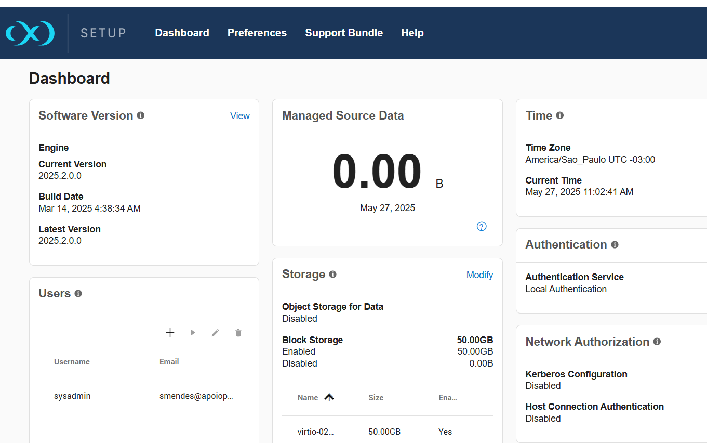

## Registro do Delphix

### Login - Sysadmin

url: http://x.x.x.x/login/index.html#serverSetup (Inserir o IP do Host do Delphix))

Alterar a tela inicial para Setup para registro do produto. 

Após entrar no link Setup a tela de logon será alterada.

### Tela Inicial como Sysadmin

Entrar do widget Registration - Opção VIEW

Dentro de Registration, ir até a seção "Registration Code" e pedir para copiar para o clipboard as informações disponíveis.

# Obs. Para registro é necessário solicitar junto aos responsáveis a ativação do produto com os dados capturados.