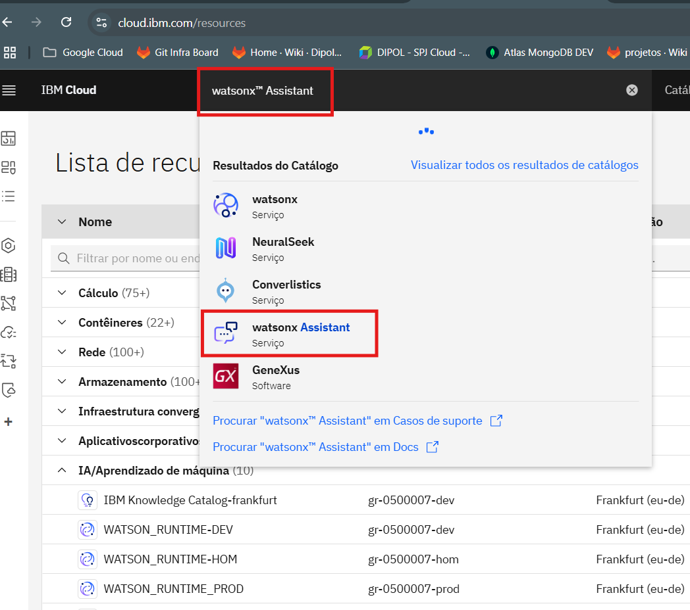
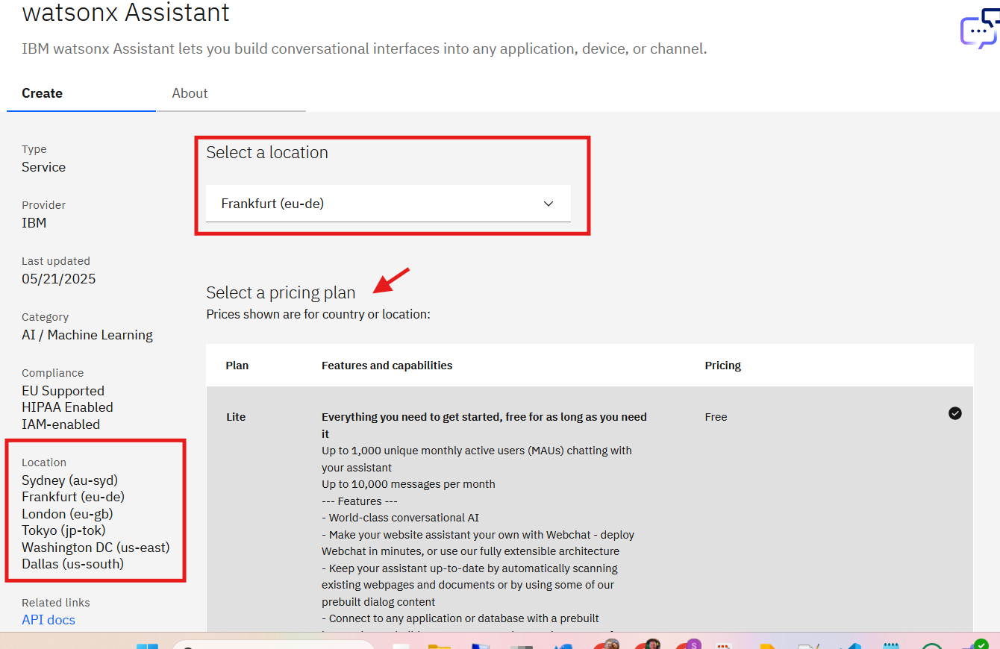
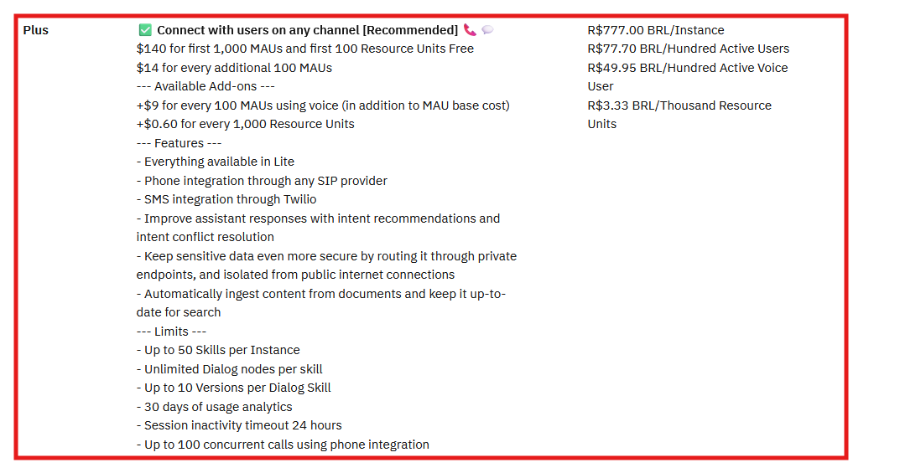
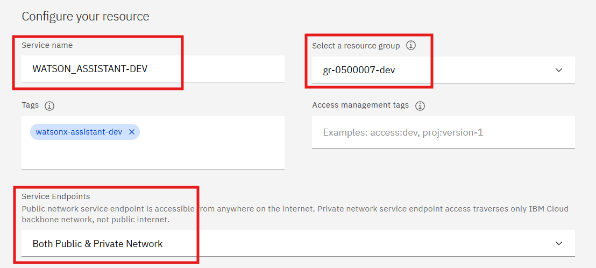
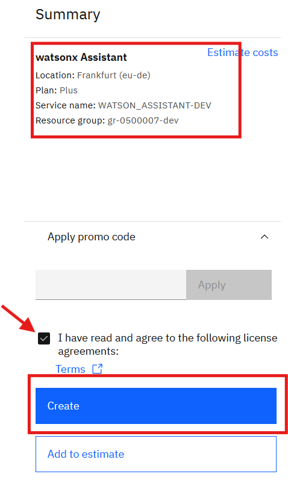
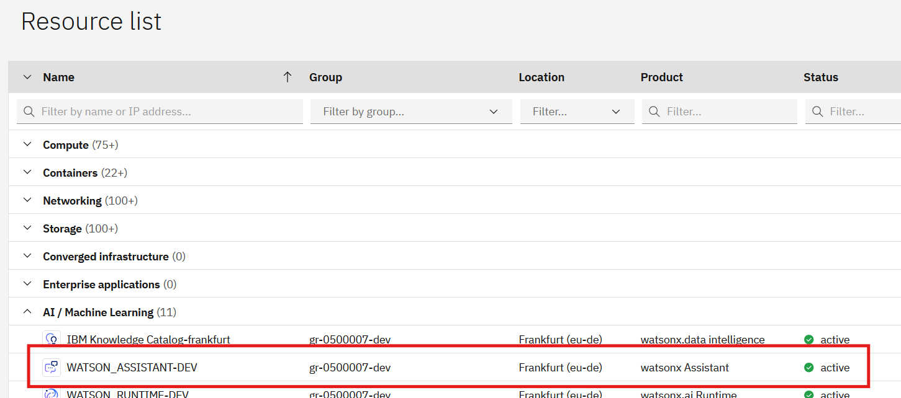

## Sobre

Documentação para auxilar no provimento do WatsonX Assistant

## Documentação:
https://cloud.ibm.com/docs/watson-assistant?topic=watson-assistant-getting-started

## Selecionar o serviço do Watsonx Assistant

## Definição do Local e plano

# Importante: Notar que o mesmo não esta disponível tem todas as localidades, aqui foi defindo como Frankfurt (eu-de).

## Escolha do Plano

## Definição do nome do Serviço e Grupo de Recursos

## Resumo e Provisionamento

## Resource List 

